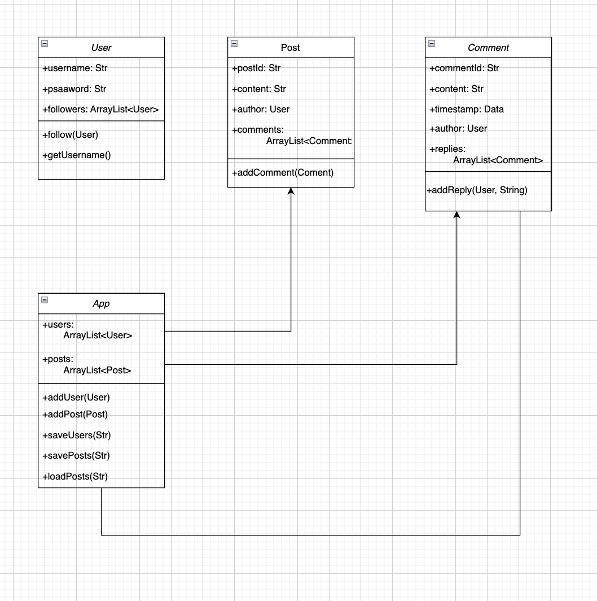

==================================================
COMP1010 Major Assignment – MQGram
==================================================

1. Overview:
------------
MQGram is a lightweight social networking simulation built using core Java. 
The application allows users to:
- Register user profiles
- Create and comment on posts
- Reply to comments recursively (nested comments)
- Persist data using Java serialization (save/load)

This application is structured with delegation, recursion, and object composition, 
in accordance with COMP1010 major assignment specifications.

2. Class Responsibilities:
--------------------------
- **User.java (Cao)**: Stores user profile data and manages follower relationships. Supports serialization for persistence.
- **Post.java (Youngjun)**: Represents individual posts created by users. Stores associated comments.
- **Comment.java (Viviana)**: Supports nested (recursive) comment replies. Includes timestamp and author info.
- **App.java (Youngjun)**: Manages all users, posts, and file operations. Central coordinator for the application.
- **Main.java**: Demonstrates end-to-end workflow (create, save, load, print).
- **Client.java** (Deprecated): Replaced by JUnit test classes.
- **JUnit Test Files**:
  * UserTest.java
  * PostTest.java
  * CommentTest.java
  * AppTest.java

3. How to Run the Program:
--------------------------
1. Compile all `.java` files using `javac` or inside an IDE (e.g., VSCode).
2. Run either `Main.java` for full workflow.
3. For tests, use VS Code test runner or run with JUnit 5 from terminal.
4. Ensure a `data/` folder exists in the working directory to hold `users.txt` and `posts.dat`.

📁 Note on File Saving:

The program saves user and post data into files inside a `data/` folder:
- `data/users.txt`
- `data/posts.dat`

Please make sure that the `data/` folder exists **before running the program**, or the program may fail with a `FileNotFoundException`.

You can create the folder manually or by running:


Example terminal commands:
```
javac src/*.java test/*.java
java -cp src Main
```

4. UML Diagram:
---------------
See accompanying file: `mqgram_uml_diagram.png`

This UML diagram shows:
- Relationships between User, Post, Comment classes
- Recursion in Comment → replies
- Delegation via App



5. Task Allocation (Team):
--------------------------
- **Youngjun Cho (48541494)** – 33.3%:
  * Post.java
  * App.java
  * File I/O save/load structure
  * Overall integration and testing

- **Viviana Abusalah (48320390)** – 33.3%:
  * Comment.java
  * Recursive structure for replies
  * Comment timestamp and debugging output

- **Tung Lam Cao (48008303)** – 33.3%:
  * User.java
  * Serialization for users
  * Follower/following mechanics

6. Method Comparison:
---------------------
**Method A: printAllPosts()**
- Function: Iterates through each Post, then each Comment (no recursion).
- Efficiency: Simple nested loop, O(n * m) where m = avg. number of comments per post
- Simplicity: Very readable, no recursion

**Method B: addReply() (in Comment class)**
- Function: Adds a comment as a reply to another comment (recursive relationship)
- Efficiency: Adding is O(1), but traversing replies is recursive
- Strength: Enables unlimited reply depth (flexible)
- Tradeoff: Slightly more complex due to recursion

==================================================
End of README
==================================================
